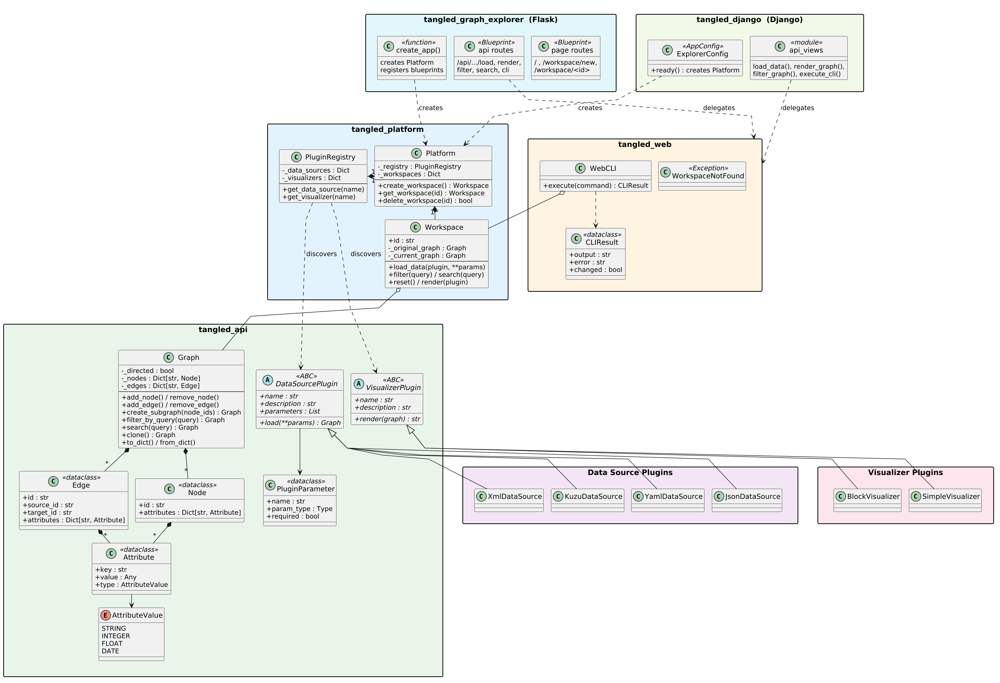

# Tangled - Graph Visualization Platform

A modular, plugin-based graph visualization platform supporting multiple data sources and visualization styles.

## Project Structure

```
tangled/
├── api/                      # Core API library (tangled-api)
│   └── src/tangled_api/      # Graph model, plugin interfaces
├── platform/                 # Platform library (tangled-platform)
│   └── src/tangled_platform/ # Plugin discovery, workspaces
├── web/                      # Shared web layer (tangled-web)
│   └── src/tangled_web/      # Services, CLI, serializers
├── json-datasource/          # JSON data source plugin
├── yaml-datasource/          # YAML data source plugin
├── xml-datasource/           # XML data source plugin
├── kuzu-datasource/          # Kuzu graph database plugin
├── simple-visualizer/        # Simple circle-based visualizer
├── block-visualizer/         # Block/rectangle visualizer with attributes
├── graph-explorer/           # Flask web application
│   └── src/tangled_graph_explorer/
├── graph-explorer-django/    # Django web application
│   └── src/tangled_django/
├── scripts/                  # Install and reinstall scripts
├── Makefile                  # Convenience targets (Linux/macOS)
├── PLUGIN_DEVELOPMENT.md     # Guide for adding plugins
└── README.md
```

## Features

- **Multiple Data Sources**: Load graphs from JSON, YAML, XML, and Kuzu databases (extensible via plugins)
- **Multiple Visualizers**: Simple and Block views (extensible via plugins)
- **Three View Modes**: Main View, Tree View, Bird View (synchronized)
- **Search & Filter**: Query-based graph filtering
- **CLI**: In-browser terminal for graph manipulation
- **Workspaces**: Multiple independent graph sessions
- **Two Web Frameworks**: Flask and Django applications included

## Architecture

Tangled follows a **Microkernel (Plugin) Architecture**. The core API defines the graph data model and plugin contracts. The platform layer handles orchestration and plugin discovery. Plugins extend functionality without modifying the core.

### Class Diagram



<details>
<summary>PlantUML source</summary>

See [`docs/class-diagram.puml`](docs/class-diagram.puml) to regenerate the image.
</details>

## Requirements

- Python 3.10+
- Linux / macOS / Windows

## Quick Start

### Linux / macOS

```bash
git clone https://github.com/re-pixel/tangled.git
cd tangled

make install
make run
```

Open http://localhost:5000 in your browser.

### Windows (PowerShell)

```powershell
git clone https://github.com/re-pixel/tangled.git
cd tangled

.\scripts\install.ps1
.\venv\Scripts\Activate.ps1
tangled
```

If script execution is disabled, run once: `Set-ExecutionPolicy -ExecutionPolicy RemoteSigned -Scope CurrentUser`

Open http://localhost:5000 in your browser.

## Development

### Makefile Targets (Linux / macOS)

On Unix systems, all common tasks are available through `make`. Run `make help` to see the full list.

| Target | Description |
|--------|-------------|
| `make install` | Create venv and install all packages |
| `make run` | Start the Flask app (default: http://localhost:5000) |
| `make run-django` | Start the Django app (default: http://localhost:5000) |
| `make test` | Run all tests with pytest |
| `make lint` | Run mypy on api and platform |
| `make reinstall` | Reinstall all packages |
| `make clean` | Remove venv and build artifacts |

**Examples:**

```bash
make install          # First-time setup
make run              # Start Flask app on port 5000
make run PORT=8080    # Start Flask app on port 8080
make run-django       # Start Django app on port 5000
make test             # Run all tests
make lint             # Type-check api and platform
```

### Windows (PowerShell)

On Windows, use the PowerShell scripts directly and activate the venv manually.

| Action | Command |
|--------|---------|
| Install | `.\scripts\install.ps1` |
| Activate venv | `.\venv\Scripts\Activate.ps1` |
| Run Flask app | `tangled` |
| Run Django app | `python graph-explorer-django\manage.py runserver` |
| Reinstall | `.\scripts\reinstall.ps1` |
| Run tests | `pytest` |

### Reinstalling After Changes

When you modify a package, reinstall it:

**Linux / macOS:**

```bash
make reinstall
```

**Windows (PowerShell):**

```powershell
.\scripts\reinstall.ps1
```

Or reinstall a single package:

```bash
pip install -e ./platform   # replace with whichever package you changed
```

### Adding a New Plugin

See [PLUGIN_DEVELOPMENT.md](PLUGIN_DEVELOPMENT.md) for the full guide.

1. Create a new directory (e.g., `csv-datasource/`)
2. Follow the structure of existing plugins
3. Implement `DataSourcePlugin` or `VisualizerPlugin`
4. Register via entry point in `pyproject.toml`
5. Install with `pip install -e ./csv-datasource`

### Running Tests

**Linux / macOS:**

```bash
make test
```

**Windows (with venv activated):**

```powershell
pip install -e ".\api[dev]"
pip install -e ".\platform[dev]"
pytest
```

### Manual Installation

If you prefer not to use the scripts or Makefile (any platform):

```bash
python3 -m venv venv
source venv/bin/activate   # Windows: .\venv\Scripts\Activate.ps1
pip install -e ./api
pip install -e ./platform
pip install -e ./web
pip install -e ./json-datasource
pip install -e ./yaml-datasource
pip install -e ./xml-datasource
pip install -e ./kuzu-datasource
pip install -e ./simple-visualizer
pip install -e ./block-visualizer
pip install -e ./graph-explorer
pip install -e ./graph-explorer-django
tangled
```

## Usage

1. Open http://localhost:5000 in your browser
2. Create a new workspace
3. Select a data source and load data
4. Use search/filter to explore the graph
5. Switch visualizers to see different representations
6. Use the CLI for advanced manipulation

## API Endpoints

| Endpoint | Method | Description |
|----------|--------|-------------|
| `/` | GET | Home page |
| `/workspace/new` | GET | Create workspace |
| `/workspace/<id>` | GET | Workspace view |
| `/api/plugins/datasources` | GET | List data sources |
| `/api/plugins/visualizers` | GET | List visualizers |
| `/api/workspace/<id>/load` | POST | Load data |
| `/api/workspace/<id>/render` | GET | Render graph |
| `/api/workspace/<id>/search` | POST | Search nodes |
| `/api/workspace/<id>/filter` | POST | Filter nodes |
| `/api/workspace/<id>/reset` | POST | Reset filters |
| `/api/workspace/<id>/cli` | POST | Execute CLI command |
| `/api/workspace/<id>/graph` | GET | Get graph data as JSON |

## Team

- Member 1: [Relja Brdar](https://github.com/re-pixel)
- Member 2: [Bojana Paunović ](https://github.com/paunovicbojana)
- Member 3: [Ivana Ignjatić ](https://github.com/iignjatic)
- Member 4: [Marko SLadjoević](https://github.com/mrsladoje)
- Member 5: [Vukan Radojević](https://github.com/Vukotije)

## License

MIT
